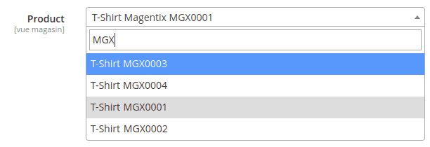

# Magento Select2 UI Component

This is a fork of [Magento-2-Module-Experius-Form-Select2](https://github.com/experius/Magento-2-Module-Experius-Form-Select2)

The module allows you to quickly search for a product or a customer in a form.



**Note:** Only simple select is supported

# Install

```
composer require magentix/magento2-module-form-select2-demo
```

# Usage

## Custom Form

```xml
<field name="product_id">
    <argument name="data" xsi:type="array">
        <item name="config" xsi:type="array">
            <item name="dataType" xsi:type="string">text</item>
            <item name="label" translate="true" xsi:type="string">Product</item>
            <item name="formElement" xsi:type="string">select</item>
            <item name="source" xsi:type="string">my_source</item>
            <item name="dataScope" xsi:type="string">product_id</item>
            <item name="validation" xsi:type="array">
                <item name="required-entry" xsi:type="boolean">true</item>
            </item>
            <item name="elementTmpl" xsi:type="string">Magentix_FormSelect2/form/element/select2</item>
            <item name="component" xsi:type="string">Magentix_FormSelect2/js/form/element/select2</item>
            <item name="select2" xsi:type="array">
                <item name="frontName" xsi:type="string">route_front_name</item> <!-- the frontName in etc/adminhtml/routes.xml -->
                <item name="minimumInputLength" xsi:type="string">3</item>
                <item name="model" xsi:type="string">product</item> <!-- product or customer -->
            </item>
        </item>
    </argument>
</field>
```

## Product form

app/code/Vendor/Module/etc/adminhtml/di.xml

```xml
<?xml version="1.0"?>
<config xmlns:xsi="http://www.w3.org/2001/XMLSchema-instance" xsi:noNamespaceSchemaLocation="urn:magento:framework:ObjectManager/etc/config.xsd">
    <virtualType name="Magento\Catalog\Ui\DataProvider\Product\Form\Modifier\Pool" type="Magento\Ui\DataProvider\Modifier\Pool">
        <arguments>
            <argument name="modifiers" xsi:type="array">
                <item name="product_test" xsi:type="array"> <!-- Attribute code -->
                    <item name="class" xsi:type="string">Vendor\Module\Ui\DataProvider\Product\Form\Modifier\ProductTest</item>
                    <item name="sortOrder" xsi:type="number">66</item>
                </item>
            </argument>
        </arguments>
    </virtualType>
</config>
```

app/code/Vendor/Module/Ui/DataProvider/Product/Form/Modifier/ProductTest.php

```php
<?php

declare(strict_types=1);

namespace Vendor\Module\Ui\DataProvider\Product\Form\Modifier;

use Magento\Ui\DataProvider\Modifier\ModifierInterface;

class ProductTest implements ModifierInterface
{
    public function modifyData(array $data): array
    {
        return $data;
    }

    public function modifyMeta(array $meta): array
    {
        $attributeCode = 'product_test'; // Update with your attribute code
    
        $config = $meta['product-details']['children']['container_' . $attributeCode]['arguments']['data']['config'] ?? false;
        
        if (!$config) {
            return $meta;
        }

        $config['formElement'] = 'select';
        $config['elementTmpl'] = 'Magentix_FormSelect2/form/element/select2';
        $config['component'] = 'Magentix_FormSelect2/js/form/element/select2';
        $config['select2'] = [
            'frontName' => 'catalog',
            'minimumInputLength' => 3,
            'model' => 'product',
        ];

        $meta['product-details']['children'][$attributeCode]['arguments']['data']['config'] = $config;

        return $meta;
    }
}
```
